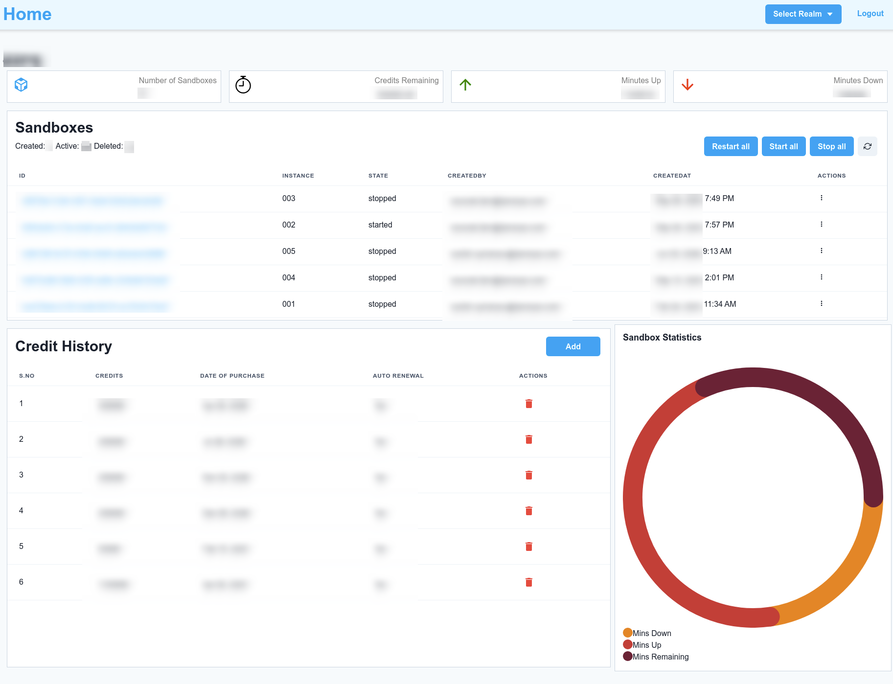
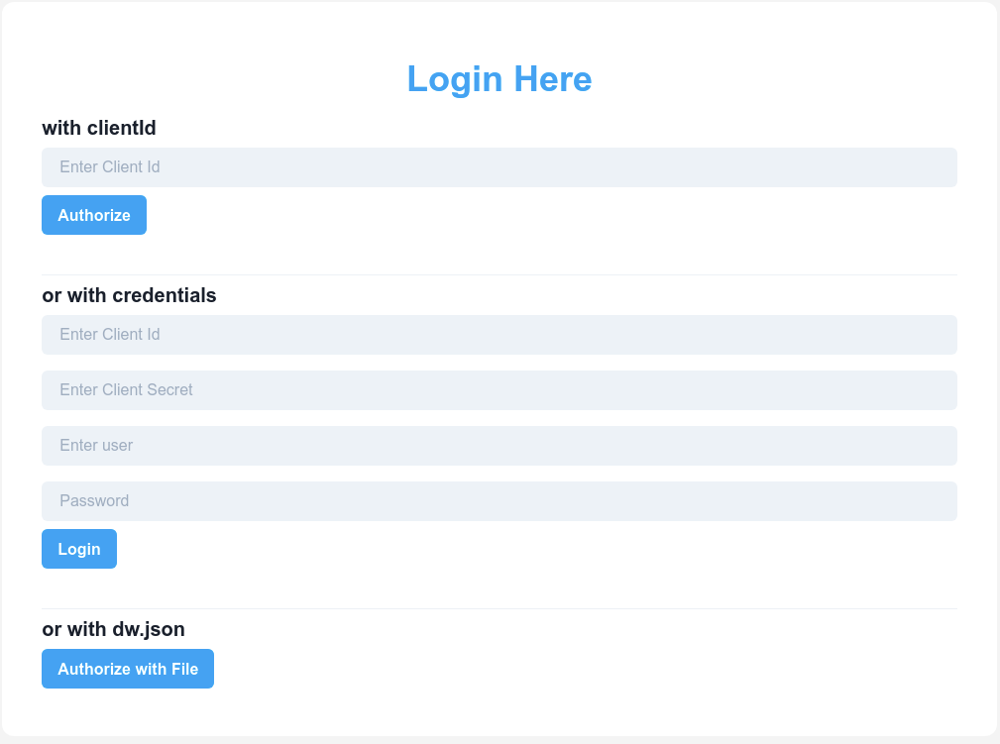
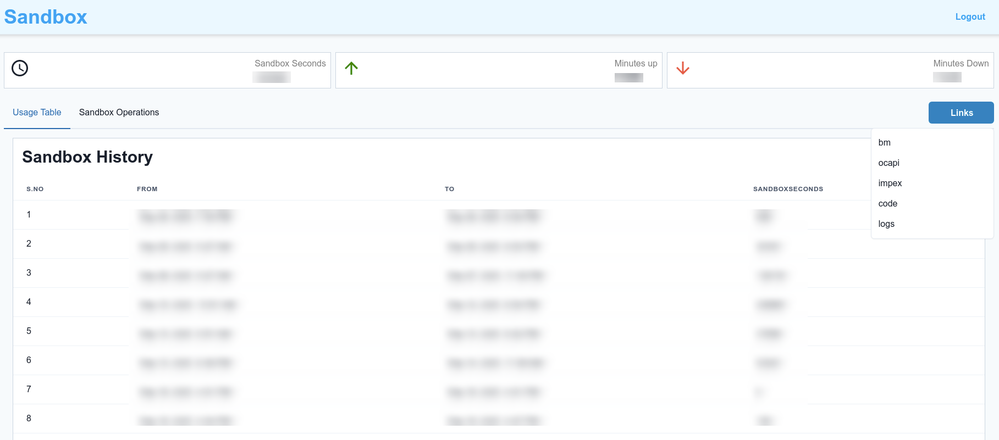

# ODS Command center
The On Demand Sandbox Command Center is a GUI tool which uses[sfcc-ci](https://github.com/SalesforceCommerceCloud/sfcc-ci) under the hood.
It aims to provide a simple interface for running sfcc-ci commands and provide usability improvements for Managers, Developers and other stakeholders.




# Why is this needed?
We have different ways to manage Salesforce B2C Commerce Cloud's On Demand Sandboxes

1. Swagger API:
2. Control Center (ODS capabilities coming soon)
3. SFCC-CI commands

While all of these provides functionality to run operations on ODS(among other things), they don't provide an interface to Monitor, Analyse and Control ODS in a single, easy to use interface.

ODS Command Center is built on React + Node.js, leverages SFCC-CI Javascript API and can be easily deployed on cloud servers.

## Features:
- Login options: 1 Click login using dw.json, login using API key & user credentials
- Realm Switcher to render dashboard for selected realm
- Bulk Operations: Restart, Start, Stop all Sandboxes in a realm
- Schedule Sandbox operations: Schedule Start/Stop operations on all Sandboxes of a Realm
- Individual operation on ODS: Start, Stop, Restart, Reset, Delete, Update COnfiguration
- Manage Credit History: Add no of credit, Purchase date, Support ticket link for reference, Auto-renewal flag
- Pie-chart to show Remaning, Uptime, Downtime Credit percent usages
- Realm Statistics: Active Sandboxes, Credits remaining, Minutes up, Minutes down
- Details for individual sandbox: Usage history, Operations history, Quick links Minutes up, Minutes down

## Upcoming Features:
- User & Role management, for better logging of operations performed and controlling access.
- Usage Calculator:
    - Predicts remaining days of usage based on current up/down time and no of sandboxes
    - Calcule usage percentage based on user input of uptime/downtime(taking weekends into consideration), no of sandboxes
- Upload dw.json through GUI
- Graphical representation of Sandbox usage and operations
- Notification Center:
    - Manage notification settings, turn-on/off.
    - Slack and SMS notifications
    - Manage contacts who should be notified
    - Manage SMTP, SMS configurations through GUI
    - Notifications for critical operations(Delete, Reset Sandboxes)
- Log file for debbugging
- Demo mode & Demo site on Heroku using dummy data
- Caching to avoid frequent API calling
- Docker container
- Email Notification when credit usages hits predefined limit(50%, 75%, 90%).


# Getting Started
## Prepare

- Check Prerequisites in [SFCC-CI repo](https://github.com/SalesforceCommerceCloud/sfcc-ci#configure-an-api-key) to setup your API key and roles. If you still stuck somewhere, I have detailed the steps in this [Medium post](https://sachinupmanyu.medium.com/sfcc-automating-on-demand-sandboxes-53a114d245f0), please check that.
- Clone or download this repository
- (Optional) Create a dw.json file(or copy sample file from docs/dw.json) and put it in server folder, so that we have `server/dw.json`.
    - Update dw.json with your API and User credentials.
    - If you are not familiar with the format, please follow above links for this.
- Copy `docs/database.sqlite3` file and put it in `server/` folder.
- Create `client/.env` file using .env.example file in respective folder, update environment variables.


## Running on Local system
- We would require NPM to be available on local system, recommended Node version is 12.19.0. If you don't have it already installed check installation instruction for [NVM](https://github.com/nvm-sh/nvm)(recommended, so that you can easilt manage multiple node versions) or install Node.js through [official site](https://nodejs.org/)
- Go to `<project_root_folder>` and run `npm run build`, after build process is complete run `npm start` command.
- goto `localhost:3009` in your web browser.
- Login using your preferred method.

## Running on remote server
You can easily set this up on Heroku or your preferred hosting solution, so that other users can also perform operation, view usage statistics and get notified about relevant information.

- Complete the prerequisities.
- Update `client/.env` with Production details.
- Upload to server
- To deploy on Heroku, follow the [official guide](https://devcenter.heroku.com/articles/deploying-nodejs).

## Credits
ODS Command Center is using [SFCC-CI](https://github.com/SalesforceCommerceCloud/sfcc-ci) Javascript APIs under the hood and was created for Salesforce Community by
- [Sachin Upmanyu](https://github.com/sachin-upmanyu)
- [Priti Kabra](https://github.com/priti-kabra)
- [Keshav Kabra](https://github.com/ksvkabra)

## Contributing
Feature requests, Pull requests, Issues or Ideas are always welcome.

## License
This software is using [MIT License](https://opensource.org/licenses/MIT)

```
Permission is hereby granted, free of charge, to any person obtaining a copy of this software and associated documentation files (the "Software"), to deal in the Software without restriction, including without limitation the rights to use, copy, modify, merge, publish, distribute, sublicense, and/or sell copies of the Software, and to permit persons to whom the Software is furnished to do so, subject to the following conditions:

The above copyright notice and this permission notice shall be included in all copies or substantial portions of the Software.

THE SOFTWARE IS PROVIDED "AS IS", WITHOUT WARRANTY OF ANY KIND, EXPRESS OR IMPLIED, INCLUDING BUT NOT LIMITED TO THE WARRANTIES OF MERCHANTABILITY, FITNESS FOR A PARTICULAR PURPOSE AND NONINFRINGEMENT. IN NO EVENT SHALL THE AUTHORS OR COPYRIGHT HOLDERS BE LIABLE FOR ANY CLAIM, DAMAGES OR OTHER LIABILITY, WHETHER IN AN ACTION OF CONTRACT, TORT OR OTHERWISE, ARISING FROM, OUT OF OR IN CONNECTION WITH THE SOFTWARE OR THE USE OR OTHER DEALINGS IN THE SOFTWARE.
```

## Additional Images

### Login options


### Sandbox details

